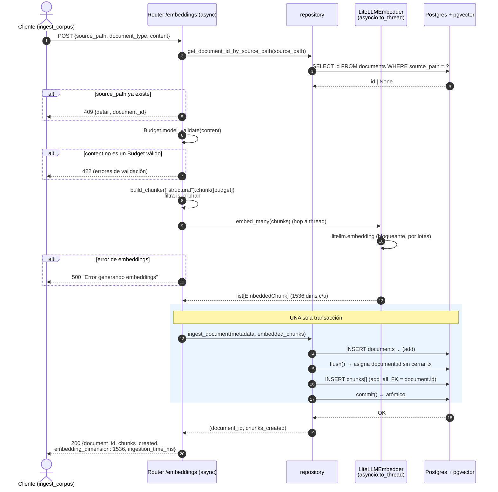
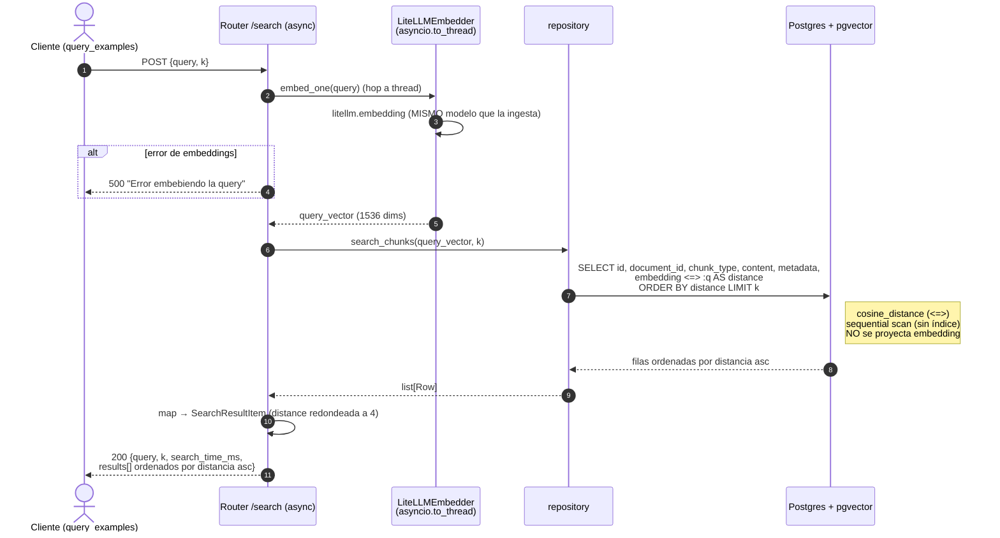

# Estimator CAG

Servicio FastAPI que recibe la transcripción de una reunión con un
cliente y devuelve una estimación de software generada por un LLM,
usando arquitectura **CAG** (Cache Augmented Generation): el contexto
de ejemplos previos se inyecta directamente en el system prompt en cada
llamada — sin base de datos ni retrieval semántico.

En la rama `pre-session-04` el servicio da el salto de "chat con
textarea libre" a **producto con formulario tipado y prompts
versionados como código**:

- El endpoint `POST /api/v1/estimate` cambia drásticamente: deja de
  aceptar `transcription` con preprocessing/evaluation/thinking_budget
  y pasa a recibir un cuerpo `{description, project_type, detail_level,
  output_format}` producido por un **formulario** en el cliente.
- Los prompts salen del código a **templates Jinja2 versionados** bajo
  `app/prompts/estimation/v1/` (system, user, examples). El `loader.py`
  es el único punto que toca los templates.
- El cliente Streamlit pasa de chat conversacional a **formulario con
  `st.form`**, captura los parámetros tipados y hace POST al backend.
- El endpoint `POST /api/v1/estimate/stream` (SSE) de session-03 **se
  mantiene intacto** con su schema legacy y su flujo de streaming —
  pendiente de migración o eliminación en session-04.

Las cinco capas de session-03 (wrapper LiteLLM con fallback, cache
exact-match Redis, SSE, structlog con request_id, Streamlit como
cliente HTTP puro) siguen exactamente igual.

---

## Requisitos

- **Docker** y **Docker Compose** (recomendado).
- Alternativa local: Python 3.11+ y `uv`
  ([instalación](https://docs.astral.sh/uv/getting-started/installation/)).
- Una API key activa en al menos uno de los dos proveedores: Anthropic u
  OpenAI.
- `jq` para los scripts de demo (`brew install jq` en macOS).

---

## Setup con Docker (recomendado)

```bash
cd estimator-cag
cp .env.example .env
# Edita .env y rellena ANTHROPIC_API_KEY (o OPENAI_API_KEY)

docker compose up --build
```

El servicio queda disponible en:

- API: http://localhost:8000
- Swagger UI: http://localhost:8000/docs
- Health: http://localhost:8000/health

`docker-compose.yml` monta `./app` como volumen read-only y arranca
`uvicorn --reload`, así que cualquier cambio en el código se recarga
sin reconstruir la imagen. Desde S04 la imagen de Redis es
`redis/redis-stack` (no `redis:7-alpine`) porque `redisvl.SemanticCache`
requiere el módulo **RediSearch**. RedisInsight queda expuesto en
`http://localhost:8001` para inspeccionar el índice y las keys.

Para parar:

```bash
docker compose down
```

---

## Setup local sin Docker

```bash
cd estimator-cag
cp .env.example .env
# Edita .env

uv sync
uv run uvicorn app.main:app --reload
```

---

## Interfaz de producto (Streamlit con formulario)

`streamlit_app.py` es un **cliente HTTP puro**: no importa nada de
`app.*`. A partir de pre-session-04 ya no es un chat conversacional:
es un **formulario** con `st.form` que captura parámetros tipados y
hace `POST /api/v1/estimate` al backend con el nuevo schema. La
respuesta llega de golpe tras un `st.spinner` — sin streaming token
a token.

### Arrancar el sistema completo

Necesitas dos procesos: el backend (con Redis) en Docker, y el
Streamlit local con hot-reload.

```bash
# Terminal 1: backend FastAPI + Redis
cd estimator-cag
docker compose up --build

# Terminal 2: Streamlit
cd estimator-cag
uv run streamlit run streamlit_app.py
```

- Backend: http://localhost:8000
- Swagger UI: http://localhost:8000/docs
- Streamlit: http://localhost:8501

### Campos del formulario

| Campo | Widget | Mapeo |
|---|---|---|
| Project description | `st.text_area` (10–4000 chars) | `description` |
| Project type | `st.selectbox` | `mobile_app` / `web_saas` / `internal_tool` / `integration` / `other` |
| Detail level | `st.selectbox` | `summary` / `medium` / `detailed` |
| Output format | `st.radio` horizontal | `phases_table` / `line_items` / `narrative` |

> Desde S04 el resultado se renderiza estructurado: `st.metric` × 3
> (duration / cost / confidence), `st.progress` con la confianza global,
> `st.dataframe` con la tabla de fases y sus assumptions, badge
> `📦 From cache (...)` cuando aplica y `st.warning` cuando el modelo
> marca la petición como `Out of scope:`.

Al enviar el formulario se hace `POST /api/v1/estimate`. La última
estimación se persiste en `st.session_state.last_result` para que
sobreviva a reruns parciales de Streamlit (cambiar un selectbox tras
recibir una respuesta no la borra de la pantalla).

### Qué cambia respecto a `session-03`

| Aspecto | session-03 | pre-session-04 |
|---|---|---|
| UX del cliente | Chat conversacional | Formulario tipado |
| Endpoint consumido | `/api/v1/estimate/stream` (SSE) | `/api/v1/estimate` (POST + JSON) |
| Streaming | Sí, token a token | No, respuesta de golpe con spinner |
| Construcción del prompt | `build_legacy_system_prompt` con f-strings | `render_estimation_prompt` con Jinja2 versionado |

---

## Variables de entorno

| Variable | Default | Descripción |
|---|---|---|
| `PRIMARY_MODEL` | `anthropic/claude-haiku-4-5-20251001` | Modelo primario en formato `<provider>/<model>` (LiteLLM) |
| `FALLBACK_MODEL` | `openai/gpt-4o-mini` | Modelo al que LiteLLM Router rota si el primario falla |
| `LLM_TIMEOUT_SECONDS` | `30` | Timeout por llamada al LLM |
| `LLM_NUM_RETRIES` | `2` | Reintentos antes de activar fallback |
| `LLM_TEMPERATURE` | `0.3` | Temperatura de muestreo (default) |
| `LLM_MAX_TOKENS` | `4000` | Máximo de tokens en la respuesta (default) |
| `ANTHROPIC_API_KEY` | *(vacío)* | API key de Anthropic. Al menos UNA de las dos debe estar configurada o la app falla al arrancar. |
| `OPENAI_API_KEY` | *(vacío)* | API key de OpenAI |
| `REDIS_URL` | `redis://localhost:6379/0` | URL del Redis. En docker-compose se sobrescribe a `redis://redis:6379/0`. |
| `CACHE_TTL_SECONDS` | `86400` | TTL de las entradas de cache (24h) |
| `CACHE_ENABLED` | `true` | Si `false`, la cache se desactiva globalmente |
| `DEFAULT_NUM_EXAMPLES` | `3` | Número de ejemplos a inyectar (informativo; el request manda) |
| `DEFAULT_PREPROCESSING` | `none` | Estrategia de preprocesado por defecto |
| `DEFAULT_OUTPUT_FORMAT` | `markdown` | Formato de salida por defecto |
| `BACKEND_URL` | `http://localhost:8000` | URL del backend desde el Streamlit |
| `ENVIRONMENT` | `development` | `development` → ConsoleRenderer; `production` → JSONRenderer |
| `LOG_LEVEL` | `INFO` | Nivel mínimo de los logs estructurados |

> Las variables `LLM_PROVIDER` y `LLM_MODEL` de session-02 quedaron
> obsoletas: ahora un solo identificador con prefijo (`PRIMARY_MODEL`)
> sustituye al par proveedor + modelo y se lo damos directamente a
> LiteLLM Router.

---

## Request y respuesta del endpoint principal

`POST /api/v1/estimate` acepta un cuerpo JSON con cuatro campos, todos
obligatorios:

| Campo | Tipo | Descripción |
|---|---|---|
| `description` | string (20–2000) | Descripción libre del proyecto. |
| `project_type` | enum | `mobile_app` / `web_saas` / `internal_tool` / `data_pipeline` |
| `detail_level` | enum | `summary` / `medium` / `detailed` |
| `output_format` | enum | `phases_table` / `line_items` / `narrative` |

La respuesta es minimal:

```json
{
  "text": "| phase | duration_weeks | cost_eur | ...",
  "prompt_version": "v1"
}
```

`prompt_version` permite saber qué subdirectorio bajo
`app/prompts/estimation/` produjo la respuesta. Útil para A/B testing y
para depurar regresiones cuando se introduce un `v2/`.

> **Nota**: features de session-02 (preprocessing, evaluation,
> thinking_budget, token_usage, cache_hit, output_format=json) **se
> eliminaron del endpoint /estimate**. Reaparecerán en session-04 con un
> diseño nuevo basado en structured outputs y guardrails. Mientras
> tanto, `evaluation_service.py` y `context/examples.py` quedan en
> standby, alimentando solo el endpoint legacy `/estimate/stream`.

Ejemplo de uso con curl:

```bash
./examples/example-form-request.sh
```

---

## Estructura de prompts (Jinja2)

Los prompts viven en `app/prompts/`:

```
app/prompts/
├── loader.py                       ← único punto que toca los templates
└── estimation/
    └── v1/
        ├── system.j2               ← rol del modelo + reglas de output
        ├── user.j2                 ← envoltorio mínimo de la description
        └── examples.j2             ← 3 few-shot examples
```

Diseño del `Environment` de Jinja2 en `loader.py`:

- **`StrictUndefined`**: si un template referencia una variable no
  provista, el render rompe con `UndefinedError` en lugar de generar un
  prompt malformado silenciosamente.
- **`trim_blocks` + `lstrip_blocks`**: los bloques `` no
  introducen saltos de línea espurios.
- **`FileSystemLoader(app/prompts/)`**: permite usar ``
  desde cualquier subdirectorio.

Versionado: para iterar en un prompt sin tocar el existente, copia
`v1/` a `v2/`, modifica, y cambia el parámetro `version="v2"` en el
loader o en el llamador. Esto permite A/B testing y rollback rápido.
En esta rama solo existe `v1/`.

---

## Tests

```bash
# Solo los tests del template (no tocan APIs externas, < 1s):
uv run pytest tests/prompts/ -v

# Todos los tests (incluye health, requiere el .venv configurado):
uv run pytest -v

# Dentro del contenedor (los tests/ no están copiados; usar local):
uv run pytest
```

En esta rama hay:

- `tests/test_health.py` — heredado de pre-session-02.
- `tests/prompts/test_estimation_v1.py` — 6 tests sobre el render del
  template Jinja2: interpolación literal de `description`, ramas de
  `output_format`, instrucción condicional de `detail_level`,
  humanización del `project_type`, inclusión del bloque `<examples>`,
  comportamiento de `StrictUndefined`.

---

## Endpoints disponibles

| Método | Path | Schema | Notas |
|---|---|---|---|
| `GET` | `/health` | — | Health check |
| `POST` | `/api/v1/estimate` | `EstimationRequest` → `EstimationResponse` | **Schema nuevo** desde pre-session-04: `{description, project_type, detail_level, output_format}` → `{text, prompt_version}`. Prompt renderizado vía Jinja2. |
| `POST` | `/api/v1/estimate/stream` | `StreamEstimationRequest` → SSE | **Legacy de session-03**: acepta `{transcription, num_examples}`. Eventos `delta` / `done` / `error`. Pendiente de migración o eliminación en session-04. |

### Por qué dos endpoints (estado transicional)

Esta rama deja el proyecto en un estado **intencionadamente híbrido**:

- `/estimate` es el endpoint nuevo del producto: formulario tipado,
  prompt compuesto con templates versionados.
- `/estimate/stream` se mantiene intacto desde session-03 para no
  perder la infraestructura de streaming, aunque ningún cliente del
  proyecto lo consume ya.

En session-04 (sesión en vivo) habrá que decidir si se migra el stream
al nuevo schema, se sustituye por uno compatible con Instructor +
structured outputs, o se elimina directamente. Hasta entonces, los dos
schemas coexisten — los del legacy con prefijo `Legacy*` en
`app/schemas/legacy_estimation.py` para que la separación sea obvia.

---

## Cache exact-match Redis

Toda llamada al LLM pasa primero por la cache. La clave es un SHA-256
sobre `{system_prompt, user_message, model, max_tokens, thinking_budget}`.
TTL = 24h.

| Caso | Comportamiento |
|---|---|
| Cache hit en `/estimate` | Respuesta inmediata con `cache_hit: true`. Sin llamada al LLM. |
| Cache hit en `/estimate/stream` | Un único evento SSE `delta` con la respuesta completa, luego `done`. |
| Redis caído al arrancar | `cache_connection_failed` en logs, `enabled=False`, app sigue funcionando sin cache. |
| Redis cae a mid-flight | Los métodos `get`/`set` registran un warning y devuelven `None` / no-op. |

### Cuándo hace hit `/estimate`

`/estimate` usa **selección random de ejemplos** por defecto (preserva
el demo del punto de saturación de session-02). Dos llamadas idénticas
suelen producir cache miss porque el system prompt cambia al rotar los
ejemplos. Hace hit solo cuando coinciden todos los parámetros y la
selección random produce el mismo subset.

### Cuándo hace hit `/estimate/stream`

`/estimate/stream` usa **selección determinista** (`deterministic=True`):
los primeros N ejemplos en el orden de `ESTIMATION_EXAMPLES`. La segunda
llamada idéntica garantiza cache hit, mismo system prompt → misma clave.

---

## Observabilidad

`structlog` configurado en `app.core.logging_config`. Dual output:

- `ENVIRONMENT=development` → `ConsoleRenderer` coloreado.
- `ENVIRONMENT=production` → `JSONRenderer` line-delimited.

Cada request HTTP arrastra un `request_id` (UUID4 o el del header
`X-Request-ID` si el cliente lo envía). El middleware lo bindea al
contexto vía `structlog.contextvars`, así que **todos** los logs
emitidos durante esa request lo llevan automáticamente.

Eventos clave a vigilar:

| Evento | Cuándo se emite |
|---|---|
| `cache_connected` | Al arrancar, si Redis responde al ping |
| `cache_connection_failed` | Al arrancar, si Redis no está disponible |
| `llm_cache_hit` | El wrapper encuentra la respuesta en cache |
| `llm_call_started` / `llm_call_completed` | Ciclo de llamada al LLM (no-stream) |
| `llm_stream_started` / `llm_stream_completed` | Ciclo de streaming |
| `llm_call_failed` / `llm_stream_failed` | Error durante la llamada |
| `stream_client_disconnected` | Cliente cerró el SSE antes del fin |

---

## Arquitectura

```
HTTP POST /api/v1/estimate                  HTTP POST /api/v1/estimate/stream
        │ (nuevo schema tipado)                       │ (schema legacy)
        ▼                                             ▼
  Router (delgado)                              Router (bridge sync→async)
        │                                             │
        ▼                                             ▼
  generate_estimation(request)               wrapper.complete_stream(...)
        │                                             │ (iterador sync)
        ▼                                             │
  render_estimation_prompt(request, v1)               ├─ loop.run_in_executor()
        │                                             │   (thread productor)
        ├── app/prompts/estimation/v1/system.j2       │
        ├── app/prompts/estimation/v1/user.j2         ├─ asyncio.Queue
        │      │
        │                                             ▼
        ▼                                       sse_starlette.EventSourceResponse
  wrapper.complete(system, user, ...)                 │
        │                                             ▼
        ▼                                       chunks SSE al cliente
  EstimationResponse(text, prompt_version)


Wrapper (app/core/llm_wrapper.py) — sin cambios desde session-03:
        ┌────────────────────────────────────────┐
        │ 1. _make_cache_key (SHA-256)           │
        │ 2. ExactMatchCache.get(key) → hit?     │
        │    └─ sí: yield text / return dict     │
        │ 3. router.completion(...)              │
        │    └─ LiteLLM Router: primary→fallback │
        │ 4. normalize dict                      │
        │ 5. ExactMatchCache.set(key, value)     │
        │ 6. yield / return                      │
        └────────────────────────────────────────┘
```

### Decisiones de la rama

- **Borrón y cuenta nueva en `/estimate`**: el schema viejo no se
  preserva, no hay backwards compatibility. Las features de session-02
  (preprocessing, evaluation, thinking_budget, etc.) desaparecen del
  endpoint principal y reaparecerán en session-04 con un diseño nuevo.
- **El loader es el único punto que toca los templates**. Si encuentras
  `_env.from_string(...)` o `open()` de archivos `.j2` fuera de
  `app/prompts/loader.py`, es un bug.
- **`StrictUndefined` siempre activo**: render rompe con error si una
  variable no está definida. Detecta typos y refactors a medias.
- **`evaluation_service.py` y `context/examples.py` quedan en standby**:
  no se invocan, pero siguen compilando con imports al paquete
  `legacy_estimation`.
- **El Streamlit pasa de chat a formulario** y **deja de consumir
  SSE**. La UX de streaming queda solo en el endpoint legacy hasta que
  session-04 decida qué hacer con él.

---

## Qué entra en session-04

- **Structured outputs** con Instructor + Pydantic para forzar JSON
  validado en lugar de texto libre.
- **Guardrails** de input/output: Moderation API, validators de PII,
  scope checks, LLM-as-judge.
- **Cache semántico** con embeddings + `redisvl.SemanticCache`, en
  paralelo al cache exact-match actual.
- **Decisión sobre `/estimate/stream`** y `legacy_estimation.py`:
  migrar, reemplazar o eliminar.
- **Posible extracción del Streamlit** a otro proyecto separado.

---

## Sesión 04

La rama `session-04` añade structured outputs con Instructor, cinco
capas de guardrails y cache semántico con `redisvl`, eliminando todo
el código legacy de streaming y evaluación.

### Cambios destructivos respecto a `pre-session-04`

- **El endpoint `POST /api/v1/estimate/stream` ya no existe.** El
  servicio sirve una única ruta: `POST /api/v1/estimate` con respuesta
  síncrona y estructurada.
- **El wrapper LiteLLM expone un único método público**
  `complete_structured(...)`. `complete()` y `complete_stream()` se
  han eliminado.
- **`app/schemas/legacy_estimation.py`, `app/services/evaluation_service.py`
  y `app/context/`** se han borrado del repo.
- **La dependencia `sse-starlette`** se ha retirado.
- **`app/core/cache.py`** se ha movido (con `git mv`) a
  `app/services/cache/exact_match_cache.py` y convive ahora con
  `app/services/cache/semantic_cache.py`.
- **El enum `ProjectType`** sustituye `data_pipeline` por
  `integration` y añade `other`.

### Variables de entorno nuevas

| Variable | Default | Descripción |
|---|---|---|
| `EMBEDDINGS_MODEL` | `text-embedding-3-small` | Modelo de embeddings de OpenAI usado por el cache semántico |
| `EMBEDDINGS_DIMENSIONS` | `1536` | Dimensiones del vector |
| `SEMANTIC_CACHE_ENABLED` | `true` | Activa el cache semántico |
| `SEMANTIC_CACHE_THRESHOLD` | `0.92` | Umbral de similitud para hit (0-1) |
| `SEMANTIC_CACHE_TTL_SECONDS` | `86400` | TTL del cache semántico |
| `SEMANTIC_CACHE_NAME` | `estimator_semantic_cache` | Nombre del índice en Redis |
| `MODERATION_ENABLED` | `true` | Activa OpenAI Moderation API en input |
| `MIN_CONFIDENCE_PCT` | `30` | Umbral mínimo de confianza para cachear |
| `PROMPT_VERSION` | `v2` | Versión del template que se renderiza por defecto |

### Las cinco capas de guardrails

1. **Pydantic sintáctico del input** — `EstimationRequest` valida
   tipos, rangos y longitudes. Política: exception (Pydantic).
2. **Validación semántica del input** — `app/guardrails/input_guardrails.py`
   aplica regex de prompt injection, detección de PII (email, IBAN,
   teléfono) y OpenAI Moderation API en cascada. Política: exception
   (`InputGuardrailError` → HTTP 400).
3. **System prompt robusto** — `app/prompts/estimation/v2/system.j2`
   incluye `<scope>` y `<numerical_constraints>` que instruyen al
   modelo a devolver `"Out of scope:"` con totales a cero cuando la
   descripción no encaja. Política: filter (comportamiento del modelo).
4. **Validators de `EstimationResult`** — `total_must_match_sum_of_phases`
   (±1 semana, ±5% coste) y `low_confidence_must_be_explicit`.
   Política: fix con retry (Instructor reintenta hasta 3 veces).
5. **Filtro de salida** — `app/guardrails/output_guardrails.should_cache_result`
   evita persistir respuestas out-of-scope o de baja confianza.
   Política: filter (no cachea pero sí devuelve al cliente).

### Pipeline del endpoint

```
POST /api/v1/estimate
 │
 ├─ Input guardrails (regex + PII + Moderation)
 │   └─ falla → 400 con {error, category, reason}
 │
 ├─ Exact-match cache (Redis, key = SHA256(request + prompt_version))
 │   └─ hit → cached=true, cache_level="exact_match"
 │
 ├─ Semantic cache (redisvl, bucket = v2:project_type:detail_level:output_format)
 │   └─ hit → popular exact-match, cached=true, cache_level="semantic"
 │
 ├─ Render prompt v2 (Jinja2)
 │
 ├─ Instructor + LiteLLM Router (Anthropic primary, OpenAI fallback)
 │   └─ Pydantic validators fallan → Instructor retry (hasta 3 veces)
 │
 ├─ Output guardrails (out-of-scope o low confidence → no cachear)
 │
 └─ Respuesta: {result, prompt_version, cached, cache_level}
```

### Reorganización del árbol

```
app/
├── core/
│   ├── llm_wrapper.py        ← solo complete_structured
│   └── logging_config.py
├── guardrails/               ← nuevo
│   ├── input_guardrails.py
│   └── output_guardrails.py
├── prompts/
│   └── estimation/
│       ├── v1/               ← intacto (referencia)
│       └── v2/               ← nuevo (scope + numerical_constraints + ejemplos JSON)
├── routers/
│   └── estimations.py        ← un único endpoint
├── schemas/
│   └── estimation.py         ← Phase + EstimationResult + EstimationResponse rico
└── services/
    ├── cache/                ← nuevo paquete
    │   ├── exact_match_cache.py   ← movido desde app/core/cache.py
    │   └── semantic_cache.py
    └── llm_service.py        ← pipeline completo
```

> Los scripts curl en `examples/` corresponden al endpoint stream
> legacy y a respuestas en texto libre. Se mantienen sin mantenimiento
> como referencia histórica y **no se actualizan** para session-04.

---

## Pre-sesión 05

La rama `pre-session-05` transforma el servicio de "single-shot tipado" a
"conversacional con memoria y adjuntos". El endpoint `POST /api/v1/estimate`
desaparece; toda la interacción pasa por sesiones.

### Endpoints

- `POST /api/v1/sessions` → crea una sesión vacía y devuelve
  `{session_id, created_at}` (HTTP 201).
- `POST /api/v1/sessions/{session_id}/estimate` → `multipart/form-data` con
  `transcript`, `project_type`, `detail_level`, `output_format` y un campo
  `attachments` opcional (cero o más archivos PDF/.docx). Devuelve
  `EstimationResponse` (HTTP 200).

Errores HTTP estructurados:

- `400 input_guardrail` con `detail.category` cuando regex/PII/Moderation
  rechazan el input.
- `404 session_not_found` si el `session_id` no existe o caducó por TTL idle.
- `413 attachment_too_large` si un adjunto excede `ATTACHMENT_MAX_BYTES`.
- `415 unsupported_attachment` si el MIME no es PDF ni .docx.

### Variables de entorno nuevas

| Variable | Default | Descripción |
|---|---|---|
| `MAX_TURNS` | `6` | Pares user+assistant que sobreviven a la ventana deslizante del historial. |
| `SESSION_IDLE_TTL_SECONDS` | `86400` | Inactividad tras la cual una sesión se purga (24 h). |
| `ATTACHMENT_MAX_BYTES` | `10485760` | Tamaño máximo aceptado por adjunto (10 MB). |
| `PROMPT_VERSION` | `v3` | Templates `app/prompts/estimation/v3/` activos por defecto. |

### Memoria conversacional: tres estructuras independientes

- `ConversationHistory` (`app/schemas/session.py`): array de pares
  user/assistant con ventana deslizante (`MAX_TURNS`). El system prompt **no
  vive aquí**; se regenera en cada turno desde el `project_metadata`. Eso es
  lo que da resistencia al truncado.
- `ProjectMetadata`: hechos destilados sobre el proyecto en curso
  (`project_name`, `assumed_team_size`, `mentioned_technologies`,
  `agreed_scope`). Sobrevive al truncado del historial.
- `Session`: agregado con `session_id`, timestamps, `history` y
  `project_metadata`. Vive en memoria del proceso vía `SessionStore`
  (`threading.Lock` + TTL idle).

### Adjuntos: camino B (extracción local)

El servicio IA extrae el texto del PDF (`pypdf`) o del .docx (`python-docx`)
y lo concatena al user prompt con delimitadores
`<attachment filename="...">...</attachment>`. Mantiene la portabilidad del
wrapper Instructor/LiteLLM (no nos atamos a la Files API de un proveedor) y
prepara la pieza de chunking que entra con RAG en el módulo 3.

Coste asumido: se pierde la información visual del PDF (diagramas
embebidos). Para estimaciones de software, el texto cubre el caso 95%.

### LLM extractor de `project_metadata`

Tras cada turno, una segunda llamada a `complete_structured` con
`response_model=ProjectMetadataUpdate` devuelve un patch con los hechos
nuevos que aportó el intercambio. `ProjectMetadata.apply_patch` lo aplica
**sin sobrescribir hechos previos con nulos**: las listas se mergean por
unión y los escalares solo se actualizan cuando el patch trae valor no nulo.

Coste: una llamada extra al LLM por turno (~1-2 s, céntimos). Aceptable a
cambio de robustez frente a reformulaciones e idiomas mezclados.

### Pipeline del endpoint conversacional

```
POST /api/v1/sessions/{id}/estimate
 │
 ├─ Cargar sesión (404 si caducada)
 │
 ├─ Extraer adjuntos (415 si MIME no soportado, 413 si demasiado grande)
 │
 ├─ Input guardrails sobre transcript + texto de adjuntos
 │   └─ falla → 400 con {error, category, reason}
 │
 ├─ Render prompt v3 con project_metadata + bloque <attachments>
 │
 ├─ messages = history.to_api_messages(system) + último user
 │
 ├─ wrapper.complete_structured_with_messages → EstimationResult
 │
 ├─ extract_metadata_update (segunda llamada LLM)
 │   └─ apply_patch sobre session.project_metadata
 │
 ├─ history.append_turn (ventana deslizante)
 │
 └─ session_store.save → 200 EstimationResponse
```

### Cache de S04: infraestructura dormida

`app/services/cache/` sigue en el repo (clases `ExactMatchCache`,
`SemanticCacheService`, `make_exact_match_key`, `make_bucket_key`) pero
**no se invoca** desde el flujo conversacional. Justificación: la cache key
en multi-turno depende de `(transcript, attachments, history, metadata)`,
así que la tasa real de hits sería ínfima.

Mantener la infra disponible es barato y deja la puerta abierta a usos
futuros (cachear extracciones de PDF por hash, por ejemplo). El shim
`app/schemas/estimation_compat.CachedRequest` da a las clases del cache un
tipo válido sin reintroducir `EstimationRequest`.

### Limitaciones documentadas

- **Multi-worker**: `SessionStore` vive en memoria del proceso. Con
  `uvicorn --workers N` un cliente puede aterrizar en un worker que no
  conoce su `session_id`. Para multi-worker hay que migrar a Redis como
  backend de sesiones; queda fuera de pre-S05.
- **Persistencia**: el reinicio del servicio borra todas las sesiones.
- **Panel de metadata en Streamlit**: optimista, sin endpoint `GET` de
  sesión.

## Sesión 05

Cuatro piezas avanzadas sobre el flujo conversacional de pre-S05:

1. **Compresión híbrida con anclas** sustituye a la ventana deslizante
   como estrategia de gestión de historial por defecto.
2. **Tier dinámico** resuelto en runtime con un resolver heurístico de
   reglas, materializado como bloque condicional en el system prompt v3.
3. **Actor-Critic-Boss (ACB)**: tres roles aislados (genera, evalúa,
   decide) que elevan la calidad de la estimación en los caminos
   críticos. Es la pieza central de la sesión.
4. **Evals con golden dataset**: script standalone (`evals/run.py`) que
   evalúa el sistema contra ~16 casos curados al estilo de un test de
   integración.

### Compresión híbrida con anclas (default)

Antonio en directo: la ventana deslizante "hay que evitarla como la
peste" porque pierde compromisos críticos (un NDA del primer turno se
cae de la ventana y el modelo empieza a dar información que no
debería). El nuevo default es `COMPRESSION_POLICY=anchor_hybrid`. Dos
componentes:

- **Detector de anclas** 100% heurístico (regex), 8 reglas centradas en
  temas críticos (NDA, contrato firmado, alcance cerrado, presupuesto
  bloqueado, compliance, deadline, compromiso explícito, restricción
  legal). **Solo escanea mensajes del usuario**: lo que diga el
  assistant no genera anclas. Vive en
  `app/services/sessions/compression/anchors.py`.
- **Resumen acumulativo plano**, sin recursión (no resúmenes de
  resúmenes). Integra el `running_summary` previo y los turnos a
  comprimir en un resumen nuevo, preservando las anclas literalmente.

La policy `sliding_window` queda disponible para volver al
comportamiento de pre-S05; `cumulative` resume sin anclas.

### Tier dinámico con resolver heurístico

`TierResolver` evalúa una lista ordenada de reglas (`executive` → `pm`
→ `developer`) y cae a `DEFAULT_TIER` si ninguna casa. Cada regla
corre dentro de un `try/except`: si una regla rompe, el resolver
loguea y pasa a la siguiente — disciplina de "flujos deterministas
con piezas tolerantes a fallos".

**El tier se materializa como bloque condicional en
`v3/system.j2`** (`<tier_guidance>`), no como template+schema por
tier. `EstimationResult` sigue siendo único. Razón: el estimator no
tiene backend de negocio separado (no hay JWT), y el directo
simplificó deliberadamente la propuesta teórica de S5-04. Cambia solo
qué se foreground en el summary; el schema de salida no cambia.

### Actor-Critic-Boss

Tres roles **aislados** (ningún rol conoce a los otros) que orquestan
una estimación de mayor calidad:

- **Actor** (`_run_actor` en `app/services/llm_service.py`): la única
  ruta de generación. Se reutiliza en modo `actor` y dentro del loop
  ACB; cuando hay `critic_feedback`, el prompt v3 inyecta el bloque
  `<critic_feedback>` para que itere.
- **Critic** (`app/services/actor_critic_boss/critic.py`): audita la
  estimación. **Nunca reescribe**, solo marca con `field_path`
  concreto (`summary`, `phases[2].duration_weeks`, etc.) +
  `suggested_fix` obligatorio. Fallback graceful: si el LLM falla,
  devuelve `CriticFeedback.empty_accept()` y el flujo sigue.
- **Boss** (`app/services/actor_critic_boss/boss.py`): orquesta el
  loop con presupuesto duro de `ACB_MAX_ITERATIONS` (default 3).
  Decisión determinista (`accept`/`iterate`/`synthesize`); la
  síntesis es **el camino habitual**, no la excepción: con modelos de
  tier bajo, actor y crítico raramente convergen. El boss recibe
  `run_actor` por inyección para no acoplarse al actor.

El modo se fija al crear la sesión: `POST /api/v1/sessions` acepta
`{"estimation_mode": "actor" | "actor_critic_boss"}` (default
`actor`). Todos los turnos de esa sesión respetan el modo.

### Evals con golden dataset

`evals/run.py` es un script standalone, fuera de `app/` y `tests/`.
Carga `evals/golden_dataset.json` (~16 casos: happy paths, multi
componente, integraciones, multilingüe, out-of-scope, vagos) y corre
el pipeline contra cada caso, reportando `PASS`/`FAIL`. No se añade
DeepEval ni juez LLM en esta rama.

Uso:

```bash
uv run python -m evals.run                 # todos los casos, modo actor
uv run python -m evals.run --max-cases 8   # primeros 8
uv run python -m evals.run --mode actor_critic_boss
```

### Pipeline del turno (orden estricto)

```
1. validate_input (guardrails: regex injection + PII + Moderation)
2. resolver tier (heurístico, fallback graceful por regla)
3. render prompt v3 (con tier_guidance + project_metadata + adjuntos)
4. despacho por modo:
     - actor                → _run_actor(...)
     - actor_critic_boss    → BossService.run(...) (loop actor↔critic + síntesis)
5. (output guardrails sobre el EstimationResult)
6. apply_compression (anchor_hybrid | sliding_window | cumulative)
7. extract_metadata_update (LLM extractor) → ProjectMetadata.apply_patch
8. session_store.save(...) → devolver EstimationResponse enriquecido
```

`EstimationResponse` añade `tier`, `estimation_mode` y, en modo ACB,
`acb_converged` + `acb_total_iterations` + `acb_iterations[]` con el
veredicto del crítico y la decisión del boss por iteración.

### Variables de entorno nuevas

| Variable | Default | Descripción |
|---|---|---|
| `DEFAULT_TIER` | `developer` | Tier al que cae el resolver si ninguna regla aplica. |
| `COMPRESSION_POLICY` | `anchor_hybrid` | `anchor_hybrid` \| `sliding_window` \| `cumulative`. |
| `COMPRESSION_TRIGGER_TURNS` | `6` | Nº de pares user+assistant a partir del cual se comprime. |
| `COMPRESSION_KEEP_RECENT_TURNS` | `3` | Pares recientes preservados tras la compresión. |
| `ACB_MAX_ITERATIONS` | `3` | Presupuesto duro del loop del boss. |
| `CRITIC_PROMPT_VERSION` | `v1` | Versión del prompt del crítico. |
| `BOSS_PROMPT_VERSION` | `v1` | Versión del prompt del boss (síntesis). |
| `SUMMARIZER_PROMPT_VERSION` | `v1` | Versión del prompt del summarizer. |

### Cómo activar el modo ACB

Al crear la sesión:

```bash
SID=$(curl -sS -X POST http://localhost:8000/api/v1/sessions \
  -H "Content-Type: application/json" \
  -d '{"estimation_mode":"actor_critic_boss"}' | jq -r .session_id)
```

A partir de ahí, todos los turnos de esa sesión usan ACB. La UI
Streamlit expone un selector de modo en el sidebar; cambiarlo crea
una conversación nueva.

### Streamlit

- **Selector de modo** en el sidebar (`actor` / `actor_critic_boss`)
  antes del panel de metadata.
- **Tier resuelto y modo** se muestran como caption al pie de cada
  respuesta.
- **Panel ACB** con un badge de convergencia y expanders por iteración
  con los issues del crítico formateados por severidad.

### Decisiones de la rama

- La compresión con anclas **reemplaza** la ventana deslizante como
  default. Las anclas se detectan en cada turno (no solo al disparar
  la compresión) para no perderlas si el turno cae luego.
- El tier es un **bloque condicional** en `v3/system.j2`, no un
  template ni un schema separado por tier (justificación arriba).
- El crítico **nunca devuelve una estimación**: su schema
  `CriticFeedback` no contiene `EstimationResult`.
- Los tres roles ACB están **aislados**: `critic.py` no importa
  `boss.py`; el boss recibe `run_actor` por inyección.
- Fallback graceful en críticos y boss: una pieza caída degrada, no
  rompe.

### Limitaciones (heredadas + nuevas)

- **Compresión por número de turnos**, no por tokens reales. `tiktoken`
  sería la mejora futura.
- **Anclas heurísticas**, no LLM. Determinista y barato, pero rígido;
  añadir patrones es trivial.
- **Sin LLM-as-judge en evals**: las assertions son deterministas
  (out-of-scope, rango de fases, rango de coste). El juez LLM
  (DeepEval/GEval) queda para el bloque de evals avanzado.
- **Sin propagación de tier por JWT/header**: el resolver heurístico
  interno es la versión sin backend de negocio externo.

## Pre-sesión 06

La rama `pre-session-06` **no construye RAG** (eso es el directo de la
sesión 6). Construye el **baseline cuantitativo del CAG**: instrumenta el
sistema, lo somete a tres escenarios de carga y produce un `REPORT.md` con
tres curvas y dos párrafos de lectura. El objetivo es ver con datos propios
**en qué eje se rompe el CAG** (latencia, coste o pérdida de memoria) antes
de aceptar RAG como solución.

Todo el bloque es **aditivo**: no cambia el comportamiento del CAG
(`max_turns`, compresión, tier, ACB intactos) ni el resultado de ninguna
estimación. El sink de métricas es opcional (default `None`); sin él, el
comportamiento es idéntico al de session-05.

### Bloque 0 — Nivelación (instrumentación)

**Wrapper observable.** `complete_structured(...)` y
`complete_structured_with_messages(...)` usan `create_with_completion(...)`
de Instructor para capturar el `usage` crudo de LiteLLM. Un parámetro
opcional `metrics: TurnMetrics | None = None` actúa como sink: cuando se
pasa, el wrapper le agrega una `CallMetrics` (tokens, coste, latencia,
modelo) por llamada. **El retorno no cambia** (sigue siendo la instancia
Pydantic), así que ninguna de las 5+ rutas de llamada se rompe.

- `app/core/pricing.py`: tabla `MODEL_COSTS` (USD por 1M tokens,
  input/output) y `cost_for(model, tokens_in, tokens_out)`. Precios marcados
  como placeholders a verificar; si el modelo no está tarifado, coste 0 + log
  `pricing_model_unknown`.
- `app/core/metrics.py`: `CallMetrics` (una llamada) y `TurnMetrics`
  (acumulador del turno: `tokens_in/out`, `cost_usd`, `llm_latency_ms`,
  `call_count`).

**Framework de métricas de evals** (`evals/metrics.py`): patrón
`MetricResult` (`name`, `score`, `passed`, `details`) + `run_all_metrics(...)`.
Formaliza lo que `_check_case` hacía con asserts: `SchemaAdherenceMetric`,
`CostBoundsMetric`, `PhaseCountMetric`, `ContentRecallMetric` (esta con flag
`require_all` para distinguir `project_name_contains` de `technologies_any_of`).
`evals/run.py` se refactoriza para usarlas; sigue in-process con
`--max-cases`/`--mode`.

**Endpoint debug**: `GET /api/v1/sessions/{session_id}` devuelve
`SessionDebugResponse` con `turn_count`, `message_count`, `anchors_count`,
`summary_chars`, `last_resolved_tier`, `last_tier_rule`, el último
`turn_observed` y la memoria persistente (`last_summary`, `anchored_facts`,
`project_metadata`). `TierResolver.resolve` ahora devuelve `TierResolution`
(tier + `rule_name`).

### Bloque 1 — Evento `turn_observed`

`generate_estimation_in_session` crea un `TurnMetrics` por turno, lo propaga
a todas las llamadas (actor, critic, boss, extractor) y, al cerrar el turno,
emite `turn_observed` con **13 campos** y los persiste en la sesión:

| Campo(s) | Significado |
|---|---|
| `turn_index`, `session_id` | identidad |
| `enriched_transcript_chars`, `attachments_total_chars` | tamaño del input |
| `messages_in_window`, `anchors_count`, `summary_chars` | estado de memoria |
| `tokens_in`, `tokens_out`, `cost_usd` | agregado de **todas** las llamadas del turno |
| `latency_ms` | **wall-clock del turno completo** (no la suma de latencias LLM) |
| `cache_hit_kind` | siempre `"none"` (caché dormido) |
| `last_resolved_tier` | tier del turno |

### Stress test (`evals/stress/`)

```
evals/stress/
├── scenarios.py        ← 3 perfiles: growing (20 turnos), pivot, contradiction
├── fixtures/
│   └── build_pdfs.py   ← PDFs sintéticos calibrados (5/20/50/100 KB), no se comitean
├── metrics.py          ← LatencyBudgetMetric, CostBudgetMetric, MemoryDriftMetric
├── run.py              ← runner --http → results.csv (resiliente a fallos)
├── results.csv         ← deliverable (generado)
└── REPORT.md           ← deliverable (3 curvas + lectura)
```

- **Escenarios**: `growing` (requisitos acumulándose, la curva larga a N=20),
  `pivot` (cambia el stack en t5), `contradiction` (cambia el presupuesto en
  t8). El `fact_to_remember` es un término corto buscable (`"Nimbus"`,
  `"Flutter"`, `"30000"`) porque `MemoryDriftMetric` hace match literal
  case-insensitive.
- **`MemoryDriftMetric`** mide la **memoria persistente** (`running_summary` ∪
  `anchored_facts` ∪ `project_metadata`), no el output del turno (que estaría
  contaminado por los mensajes recientes sin comprimir).
- **Runner**: golpea el endpoint HTTP real (latencia realista con overhead),
  lee el snapshot vía `GET /sessions/{id}`, evalúa las tres métricas y vuelca
  CSV. Un turno que devuelve 500 (el CAG no converge a un `EstimationResult`
  válido tras los reintentos de Instructor) se **registra como dato**
  (`http_status`), no aborta la corrida.

Uso (el `SessionStore` es in-memory, no requiere Redis para el flujo
conversacional):

```bash
# Terminal 1: servidor
uv run uvicorn app.main:app

# Terminal 2:
uv run python -m evals.stress.fixtures.build_pdfs          # regenera los PDFs
uv run python -m evals.stress.run --http http://localhost:8000 \
    --scenarios growing,pivot,contradiction \
    --attachment-sizes 0,100 --repeats 1 \
    --output evals/stress/results.csv
```

### Hallazgo del baseline

Sobre una corrida de 72 turnos (modo `actor`):

- **La latencia domina**: el 99% de los turnos incumple un SLA de 4s (P50
  ≈ 19s, P95 ≈ 63s, máx 108s) y crece con `tokens_in`.
- **La memoria NO se degrada**: recall del `project_name` 100% hasta N=20 —
  sobrevive en `project_metadata`, que se reinyecta cada turno.
- **El coste crece** (×2.4 por turno en `growing`) pero en absoluto es bajo
  ($0.27 por 20 turnos sin adjunto, $0.61 con adjunto de 100 KB).
- **Fallos duros (500)** bajo contexto saturado (historial largo + adjunto
  grande).

Conclusión: el CAG se rompe por **latencia** (y fallos de validación bajo
saturación), no por olvido. Eso justifica RAG: acotar `tokens_in`
recuperando solo lo relevante. Detalle en `evals/stress/REPORT.md`.

### Decisiones de la rama

- **Sink opcional, no cambio de retorno**: instrumentar sin romper las 5+
  rutas de llamada al wrapper.
- **No se mueve el wrapper** de `app/core/` (el ejercicio citaba
  `app/services/`); el pricing vive en `app/core/pricing.py`, junto al wrapper.
- **`cache_hit_kind` siempre `"none"`**: el flujo conversacional no consulta
  caché (heredado de pre-S05); se documenta como característica, no como fallo.
- **El runner usa `--http`** para medir latencia con overhead de endpoint real.

### Caveats documentados en el REPORT

- **Caché dormido**: el CAG paga el contexto completo en cada turno (curva de
  coste más empinada que con caché).
- **El Router usa `routing_strategy="simple-shuffle"`** con primary + fallback
  bajo el mismo alias → reparte llamadas entre Haiku y gpt-4o-mini; **no es
  single-provider** como asumía el ejercicio. Comportamiento heredado de
  session-05, no se tocó (la instrumentación es aditiva).
- **Precios placeholders**: `MODEL_COSTS` debe verificarse contra tarifas
  oficiales; lo que el baseline lee es la *forma* de la curva.

### Limitaciones

- **Sin `tiktoken`**: los tokens vienen de `response.usage` de LiteLLM (reales,
  no estimados), pero la compresión sigue contando por turnos, no por tokens.
- **Latencia con ruido**: el reparto de modelos del Router introduce varianza
  turn-a-turno; la tendencia (latencia alta y creciente) es clara, el factor
  exacto fluctúa entre corridas.

---

## Sesión 06 — Módulo de ingesta de datos

La rama `session-06` implementa los **pasos 1–4 del "viaje del dato"**
(Data-Driven AI): catálogo de fuentes como código, contrato `Document`
canónico, pipeline `loaders → parsers → cleaning → normalizers → orchestrator`
y un endpoint de ingesta bloqueante. Todo el bloque es **aditivo y aislado**:
vive en `app/ingest/` y **no se cablea** al flujo conversacional/ACB/estimación.
La vectorización, el chunking, la base vectorial, el retrieval RAG y la
anonimización PII con **Presidio** quedan reservados para **session-07**.

### El viaje del dato

1. **Catálogo (el dato como código).** `data/catalog/data_catalog.yaml` se
   versiona en git, se carga con `load_catalog` y se valida contra modelos
   Pydantic (`DataCatalog`/`CatalogSource`). El pipeline solo itera sobre
   `included_sources()`; lo marcado `review`/`exclude` nunca se ingesta.
2. **Inspección + evaluación.** `inspect_filesystem_source` recoge *folder
   facts* (conteo, tamaño, antigüedad, formatos) y un **muestreo estructural**
   (claves de JSON, columnas de XLSX, flags de TXT) **sin valores crudos**. El
   evaluador LLM (`evaluate_source`, Q1) recibe **solo** esos hechos y devuelve
   una pista de calidad/sensibilidad/decisión. El catálogo es código revisado a
   mano: el LLM solo sugiere. *(En producción ese juicio debería correr contra
   un modelo on-prem local; el contrato `facts → CatalogSourceJudgment` no
   cambia si se sustituye el backend.)*
3. **Loaders → parsers → cleaning → normalizers.** Tres capas separadas: el
   loader resuelve el acceso físico y entrega bytes (no entiende formato); el
   parser extrae a una representación **intermedia** (DataFrame / turnos, no
   `Document`); la limpieza normaliza de forma determinista y valida con
   **Pandera** (`lazy=True`) enrutando por severidad (válido / cuarentena /
   descarte); el normalizer convierte al contrato canónico `Document`
   propagando los metadatos del catálogo (lineage, PII, access).
4. **Orquestador → `Document[]` en memoria.** `run_ingestion` pega todo,
   respeta la decisión del catálogo y produce `Document` **sin persistencia ni
   chunking** (eso es session-07).

### Contrato canónico

`Document{content, metadata}` con `DocumentMetadata` (schema teórico S6-04). El
downstream (chunking/embedding/retrieval) dependerá **solo** de `Document`. La
trazabilidad por construcción (`source_name` + `source_location` + lineage) es
lo que después permite citar fuentes.

### Viabilidad arquitectónica (Q2)

`app/ingest/architecture.py` decide CAG/RAG/híbrido. `summarize_baseline` lee
los números **reales** del baseline pre-S06 (`evals/stress/results.csv`,
`latency_ms` → segundos) y `IngestionArchitecture.viability()` deriva
`latency_acceptable`/`cost_per_query_acceptable` de ahí: con P95 ≈ 70 s ≫ SLA
de 4 s, `is_viable()` es `False` y la recomendación es **PURE_RAG**, defendible
con números concretos.

### Datos: catálogo comiteado, seed gitignored

El **catálogo** (`data/catalog/data_catalog.yaml`) **se versiona** con rutas
relativas a `data/seed/...`. El **seed sintético** (`data/seed/`) **no se
comitea** (`.gitignore`) pero es **reproducible de forma determinista** con
`scripts/build_seed.py` (semilla fija, defectos calibrados del directo:
importe negativo → descarte, `"to be defined"` → cuarentena, dos versiones del
mismo `budget_id` → dedup keep-last, moneda heterogénea, `budget_id` roto →
descarte, transcripción legacy sin speaker tags → review, rate card envejecido
> 365 días → exclude).

### CLIs

```bash
uv run python -m scripts.build_seed              # genera data/seed/ (gitignored)
uv run python -m scripts.inspect_sources         # inspecciona + evalúa (LLM) → data_catalog.yaml
uv run python -m scripts.inspect_sources --offline   # ídem sin LLM (determinista)
uv run python -m scripts.demo_cleaning           # demo limpieza+validación (válidos/cuarentena/descarte)
uv run python -m scripts.run_ingestion           # catálogo → orquesta → reporte de auditoría
uv run python -m scripts.recommend_architecture  # baseline real → recomendación (PURE_RAG)
```

### Endpoints

```bash
uv run uvicorn app.main:app                       # versión 0.6.0
curl localhost:8000/api/v1/ingest/catalog         # GET: estado del catálogo (included/review/excluded)
curl -X POST localhost:8000/api/v1/ingest         # POST: ejecuta la ingesta (bloqueante)
```

El endpoint `POST /api/v1/ingest` es un `def` **síncrono** a propósito: FastAPI
lo corre en threadpool, manteniendo la semántica bloqueante sin bloquear el
event loop ni romper el wrapper síncrono. Session-07 lo migrará a no-bloqueante.

### Tests

```bash
uv run pytest tests/ingest -m "not integration" -q   # cobertura del módulo
uv run pytest tests/ingest/test_catalog_evaluator.py -m integration   # juicio LLM real
```

`test_cleaning.py` fija empíricamente los nombres de los checks de la versión
instalada de Pandera; si cambian, se ajusta
`app.ingest.cleaning.policy._DISCARD_CHECKS`.

---

## Pre-sesión 07 — Pipeline de embeddings y chunking

La rama `pre-session-07` añade un **pipeline mínimo de embeddings y chunking**
(ejercicio S7-01) en `app/embedding_pipeline/`. Toma presupuestos con esquema
anidado, los parte en chunks estructurales (un componente = un chunk) con
**contextual chunk headers**, los embebe vía LiteLLM y los devuelve por HTTP.
Es un módulo **standalone y aditivo**: no importa `app/ingest/` ni el contrato
`Document` de S06, usa su propio `Budget` anidado. **Sin persistencia ni
retrieval** — el chunker de transcripciones, la base vectorial (S08 pgvector) y
la búsqueda semántica llegan después.

### Chunking estructural

`JSONStructuralChunker` produce **un `Chunk` por componente** del presupuesto.
El `text` que se embebe combina los detalles del componente con headers
contextuales del presupuesto padre (sector, año, tecnología, summary) — la
palanca de mayor ROI en RAG, una versión estática y barata de *Contextual
Retrieval* sin LLM. La **metadata filtrable** (7 campos: `budget_id`,
`component_id`, `client_sector`, `main_technology`, `year`, `complexity`,
`estimated_hours`) viaja **fuera** del texto embebido, lista para filtrar en
S08. El `chunk_id` es `"{budget_id}::{component_id}"` y el `token_count` se
calcula con **tiktoken**. No hay overlap ni splitting: un chunk anormalmente
grande solo emite un *warning* (`chunk.unusually_large`), no se parte.

### Embedder

`LiteLLMEmbedder` usa `litellm.embedding()` con **`text-embedding-3-small`**
(1536 dims), reutilizando `EMBEDDINGS_MODEL`/`OPENAI_API_KEY` ya existentes (no
se crean env vars nuevas para el modelo). El cliente es LiteLLM por
**portabilidad**: el swap futuro a Voyage AI (el embedder recomendado por
Anthropic, que no tiene embeddings propios) o Google es un cambio de string.
`embed_many` llama a la API en **batches** (`EMBEDDING_BATCH_SIZE`, default 100),
nunca una llamada por chunk, con **retry exponencial** (3×: 1/2/4 s) ante rate
limit. El coste se estima con los tokens reales de `response.usage` y una
constante de módulo etiquetada (`EMBEDDING_PRICE_PER_MILLION_TOKENS`, placeholder
a verificar).

### Endpoint

```bash
uv run uvicorn app.main:app                        # versión 0.7.0
# ingest del sample (envuelto en {"budgets": [...]})
python3 -c "import json; print(json.dumps({'budgets': json.load(open('data/budgets_sample.json'))}))" > /tmp/body.json
curl -s -X POST localhost:8000/embeddings/ingest \
  -H "Content-Type: application/json" --data @/tmp/body.json
```

`POST /embeddings/ingest` (visible en `/docs`) orquesta chunker → embedder y
devuelve `IngestResponse{chunks, stats}` con `total_budgets`, `total_chunks`,
`total_tokens` y `estimated_cost_usd`. Es un `def` **síncrono** a propósito:
`litellm.embedding()` es bloqueante y FastAPI lo corre en threadpool sin
bloquear el event loop (misma decisión que el endpoint de ingesta de S06).

### CLIs y sanity check

```bash
uv run python -m scripts.build_budgets_sample      # genera data/budgets_sample.json (15 budgets, comiteado)
uv run python -m scripts.compare \
  --text-a "OAuth 2.0 authentication backend for fintech" \
  --text-b "JWT-based authorization service for banking app"   # coseno a mano (sin numpy/sklearn)
uv run python -m scripts.sanity_check              # 3 parejas → app/embedding_pipeline/SANITY_CHECK.md
```

`compare.py` calcula la **similitud coseno a mano** con la biblioteca estándar y
es ejecutable dentro y fuera del contenedor. El sanity check de tres parejas
(cercanos / no relacionados / genéricos) deja sus números reales y la lectura en
`app/embedding_pipeline/SANITY_CHECK.md`.

### Dependencias y tests

Nueva dependencia: **`tiktoken`** (conteo de tokens). No se añade `numpy` ni
`scikit-learn` (el coseno es a mano).

```bash
uv run pytest tests/embedding_pipeline -m "not integration" -q   # schemas, chunker, coseno
uv run pytest tests/embedding_pipeline -m integration -q          # embedder real (API)
```

El test de integración fija el comportamiento real de la versión instalada de
LiteLLM (acceso a `response.data`, presencia de `usage`, clase de
`RateLimitError`).

---

## Sesión 07 — Estrategias de chunking + refactor de arquitectura

La rama `session-07` tiene dos bloques. **Bloque A** reorganiza todo `app/` en
capas serias (refactor mecánico con `git mv`, historia preservada). **Bloque B**
implementa una suite de **8 estrategias de chunking** sobre una interfaz
`Chunker` común, con un comparador de métricas. Sin persistencia/pgvector,
retrieval, queries híbridas ni Presidio: todo eso es **S08+**.

### Bloque A — Nueva arquitectura por capas

```
app/
├── main.py                  # entrypoint estable (uvicorn app.main:app)
├── foundations/             # infra transversal: config, llm_wrapper, logging,
│                            #   metrics, pricing, cache, prompts (loader + templates)
├── domain/                  # schemas compartidos (estimation, session, tier, ...)
├── api/routers/             # sessions, ingestion, embeddings
├── ingest/                  # subsistema de ingesta S06 (capa de primer nivel)
└── generation/
    ├── cag/                 # flujo conversacional + guardrails + sessions + tiers
    ├── agentic/             # boss + critic (Actor-Critic-Boss)
    └── rag/                 # chunking + embedding (+ retrieval en S08)
```

El refactor es **puramente estructural**: solo cambian rutas de import (barrido
mecánico), el comportamiento es idéntico. El loader de prompts sigue siendo el
único punto que toca templates (su ruta base se auto-ajusta vía
`Path(__file__).parent`). Va en un **commit aparte** del feature.

### Bloque B — Las 8 estrategias de chunking

Todas implementan la interfaz `Chunker` (`chunk(budgets) -> list[Chunk]`) y están
en el registry (`build_chunker(name, embedder=..., wrapper=...)`):

| Estrategia | Tipo | Cuándo usarla |
|---|---|---|
| `structural` | mecánica | **Default.** Un componente = un chunk, con contextual headers. La más coherente para este corpus JSON. |
| `recursive` | mecánica | Corta por separadores naturales sin exceder `chunk_max_tokens`. La mejor mecánica para texto largo. |
| `fixed_size` | mecánica | Trozos de tamaño fijo con overlap. Ruidosa: solo baseline ("la que nunca debéis usar"). |
| `sentence_window` | mecánica | Ventanas de N oraciones. Alto recall pero genera muchos huérfanos. |
| `hierarchical` | mecánica | Parent (presupuesto) + child (componente) con `parent_chunk_id`. "Contextual retrieval barato" sin LLM. |
| `semantic` | embedder | Corta donde la similitud coseno entre oraciones cae bajo un umbral. Reutiliza `LiteLLMEmbedder`. |
| `propositional` | LLM | Descompone cada componente en proposiciones atómicas. Precisa pero cara y propensa a huérfanos. |
| `contextual_retrieval` | LLM | Antepone contexto del documento generado por LLM (técnica de Anthropic). La más efectiva en retrieval, la más cara. |

**Huérfanos**: un chunk con `token_count < CHUNK_ORPHAN_MIN_TOKENS` se marca
`is_orphan=True` y el endpoint **no lo vectoriza** (no mete ruido en la futura BD
vectorial). El comparador los cuenta como señal de calidad.

Las estrategias LLM (`propositional`, `contextual_retrieval`) y `semantic` son
**opt-in** en las comparaciones (coste: LLM-por-chunk/componente).

### Endpoint

```bash
uv run uvicorn app.main:app                          # versión 0.7.0
# strategy opcional (default structural); inválida -> 422
python3 -c "import json;print(json.dumps({'budgets':json.load(open('data/budgets_sample.json')),'strategy':'recursive'}))" > /tmp/b.json
curl -s -X POST localhost:8000/embeddings/ingest -H "Content-Type: application/json" --data @/tmp/b.json
```

### Comparador y dimensiones

```bash
# compara estrategias (chunks, huérfanos, min/P50/P95/max tokens, latencia, coseno vs query)
uv run python -m scripts.compare_strategies --query "OAuth 2.0 authentication backend for fintech"
uv run python -m scripts.compare_strategies --strategies structural,contextual_retrieval --query "auth for fintech"
# 1536 vs 768 dimensiones (Matryoshka de text-embedding-3-small vía dimensions=)
uv run python -m scripts.compare_embeddings
```

`compare_embeddings` replica el hallazgo del directo: 768 dimensiones embeben
**más rápido** (~0.6× la latencia) con una **diferencia de coseno mínima**
(~0.013 entre pares), así que recortar dimensiones apenas degrada la señal.

### Tests

```bash
uv run pytest tests/generation/rag -m "not integration" -q   # estrategias mecánicas + comparador
uv run pytest tests/generation/rag -m integration -q          # semantic + propositional + contextual (API)
```

> **S08+**: persistencia en PostgreSQL + pgvector, retrieval / búsqueda semántica,
> queries híbridas SQL+semántica, y anonimización PII con Presidio.

## Persistencia en pgvector (pre-session-08)

El pipeline de chunking/embeddings de S07 ahora persiste en PostgreSQL + pgvector y
expone búsqueda semántica. La extensión `vector` y el esquema se gestionan con Alembic
(migración `0001`). `POST /embeddings/ingest` persiste un presupuesto como un `document`
con sus `chunks` (cada uno con su embedding) en una sola transacción; `POST /search`
devuelve los k chunks más cercanos por distancia coseno.

### Arranque

```bash
docker compose up -d postgres            # Postgres 16 con pgvector
uv run alembic upgrade head              # crea extensión + tablas documents/chunks
uv run uvicorn app.main:app              # versión 0.8.0; /docs
uv run python -m scripts.ingest_corpus   # ingesta data/budgets_sample.json (idempotente)
uv run python -m scripts.query_examples  # 5 queries → output_examples.txt
```

> Alembic y los scripts se ejecutan en local con `uv run`: la imagen del contenedor es
> `--no-dev` y no incluye `alembic/`, `scripts/` ni `data/`.

### Flujos

**Ingesta (`POST /embeddings/ingest`).** Un presupuesto se valida, se trocea con el
chunker estructural, se embebe (embedder bloqueante en un thread para no bloquear el
event loop) y se persiste —documento + chunks— en **una sola transacción**. El check de
`source_path` da `409` antes de hacer cualquier trabajo; un `content` que no es `Budget`
da `422`.



**Búsqueda (`POST /search`).** La query se embebe con el **mismo modelo** que la ingesta
y se buscan los k chunks más cercanos por distancia coseno (`<=>`). Sequential scan (sin
índice todavía) y sin proyectar la columna `embedding`.



### Decisiones de esquema

- **Dos tablas, no una.** Un presupuesto produce N chunks. Una tabla única duplicaría la
  metadata del documento en cada fila y perdería integridad referencial. Con `documents`
  (1) → `chunks` (N) y `ON DELETE CASCADE`, borrar un documento borra sus chunks sin lógica
  aplicativa.
- **`metadata` como JSONB.** La metadata estable y consultada de forma estructurada
  (`document_type`, `chunk_type`, fechas) va en columnas tipadas; la metadata variable que
  el chunker enriquece (sector, tecnologías, scope) va en JSONB con índice GIN, evitando una
  migración por cada campo nuevo.
- **`cosine_distance` (`<=>`), no L2 ni inner product.** Los embeddings de OpenAI están
  normalizados (norma 1), así que coseno e inner product dan el mismo orden; usamos coseno
  por convención de la literatura RAG y para que, si algún día migramos a un modelo que no
  normaliza, la query siga siendo correcta sin cambios. El operador queda alineado con la
  operator class `vector_cosine_ops` del índice que se añadirá en directo.
- **Sin índice vectorial todavía.** Deliberado: la sesión en vivo mide la latencia de
  `/search` sin índice, lo crea (HNSW con `vector_cosine_ops`) y vuelve a medir. Es la única
  forma de aterrizar empíricamente el orden de magnitud que aporta el índice.

## Indexación HNSW y operación (session-08)

Sobre la persistencia pgvector de pre-S08, esta sesión indexa el corpus, adopta **half-vec**
y deja la base lista para retrieval (módulo 4). El foco es indexación y operación, no
búsqueda avanzada (híbrida FTS+vector, filtros por metadata y re-ranking son módulo 4).

### Flujo de la sesión

```bash
docker compose up -d postgres && uv run alembic upgrade head   # incluye el índice half-vec (0002)
uv run python -m scripts.ingest_corpus                          # corpus real (vía HTTP /embeddings/ingest)
uv run python -m scripts.seed_synthetic_chunks --total 30000    # ruido para que el índice se note
uv run python -m scripts.measure_baseline --mode exact          # baseline seq scan (~122 ms)
uv run python -m scripts.measure_baseline --mode indexed        # con índice (~4.5 ms, ~27×)
uv run python -m scripts.tune_ef_search                         # punto dulce recall/latencia
uv run python -m scripts.compare_index                          # float32 (235 MB) vs half-vec (117 MB)
```

Resultados reales y razonamiento en
[`app/generation/rag/persistence/INDEX_REPORT.md`](app/generation/rag/persistence/INDEX_REPORT.md).
Los scripts de medición son DB-directos (no clientes HTTP): embeben las queries una vez y
cronometran solo la parte SQL, aislando el efecto del índice de la latencia del embedder.

### Decisiones

- **HNSW half-vec** (`chunks_embedding_halfvec_idx`, `halfvec_cosine_ops`, m=16, ef_construction=128):
  float16 reduce el índice a la mitad (235 → 117 MB) sin pérdida de recall en vectores
  normalizados de OpenAI. Es el índice adoptado y migrado (0002); el float32 solo se
  crea/dropea ad-hoc en `compare_index.py`.
- **Operador alineado.** `search_chunks` castea `embedding` y la query a `halfvec(1536)` y usa
  `<=>`, expresión idéntica a la del índice. Desalinear → fallback silencioso a seq scan; se
  verifica con `EXPLAIN ANALYZE` (test `test_hnsw_index_scan.py`).
- **`ef_search`** (query-time, `HNSW_EF_SEARCH`, default 40): único parámetro de runtime del
  HNSW; aplicado con `SET LOCAL` en la transacción de la request. Punto dulce recall/latencia
  (recall ~1.0); sube con el volumen del corpus.
- **Operación**: `app/generation/rag/persistence/monitoring.sql` (salud de tabla, tamaños de
  índices, uso, `ANALYZE`/`VACUUM`/`REINDEX CONCURRENTLY`). En producción,
  `CREATE INDEX CONCURRENTLY` + `maintenance_work_mem` en ventanas de bajo tráfico (runbook
  documentado en el mismo `.sql`, no en la migración: `CONCURRENTLY` no cabe en la transacción
  de Alembic).

### Variables de entorno nuevas

| Variable | Default | Descripción |
|---|---|---|
| `HNSW_M` | `16` | Conexiones por nodo del grafo HNSW (build-time; coincide con la migración 0002). |
| `HNSW_EF_CONSTRUCTION` | `128` | Tamaño de la lista de candidatos al construir el índice (build-time). |
| `HNSW_EF_SEARCH` | `40` | Candidatos explorados en query-time. Balancea recall/latencia. |

## Diagnóstico arquitectónico (pre-session-09)

Ejercicio de **diagnóstico** (S9-01), no implementación: mapea el estado del servicio IA al
cierre de S06–S08 y propone hacia dónde evolucionar. El entregable es
[`arquitectura-actual.md`](arquitectura-actual.md), con cuatro secciones (arquitectura actual,
trace anotado real, cinco fallos y propuesta de evolución). `app/` no cambia; el único Python
nuevo es el cliente del trace.

### Flujo del trace

```bash
docker compose up -d postgres && uv run alembic upgrade head
uv run python -m scripts.ingest_corpus                          # corpus real (15 budgets ≈ 33 chunks)
# borrar el seed sintético de S08 para no contaminar el top-5 del trace:
docker compose exec -T postgres psql -U estimator -d estimator \
  -c "DELETE FROM documents WHERE source_path = 'synthetic/stress-corpus';"
uv run uvicorn app.main:app                                     # v0.8.0
uv run python -m scripts.trace_pre_s09 \
  --transcript examples/transcripts/02_ambiguous.txt \
  --out examples/transcripts/trace_02_ambiguous.out.txt
```

`scripts/trace_pre_s09.py` (único Python del ejercicio) embebe la transcripción con
`LiteLLMEmbedder` (dim/norma/componentes) y hace `POST /search {query, k}` contra el servicio
S08, volcando la respuesta cruda a `examples/transcripts/trace_02_ambiguous.out.txt`.

### Hallazgo central

Contra el corpus real (33 chunks), la transcripción ambigua devuelve un top-5 con distancias
**comprimidas y altas** (0.5851–0.6325, spread 0.047): el índice ordena pero no discrimina. La
mejor coincidencia es "Cart and checkout service" de una tienda e-commerce — **justo lo que el
cliente pidió no mencionar**. De ahí salen los cinco fallos (vector promediado, negación
ignorada, asimetría query↔chunk ES/EN, **dos islas** store↔estimación, retrieval sin filtros) y
la propuesta de evolución, cuya pieza crítica es el **puente Augmentation→Generación**.

### Material

- `examples/transcripts/{01_clear,02_ambiguous,03_hard}.txt` — transcripciones de cliente (ES).
- `examples/transcripts/trace_02_ambiguous.out.txt` — salida cruda capturada del trace.
- `TEMPLATE.md` — estructura del entregable.
- `arquitectura-actual.md` — el diagnóstico (entregable).

### Fuera de alcance (módulo 4 / S09 en directo)

Reformulación de queries, reranking, nuevo retriever, módulo de generación, endpoints nuevos o
modificar `/search`. El ejercicio es diagnóstico; la implementación viene después.
