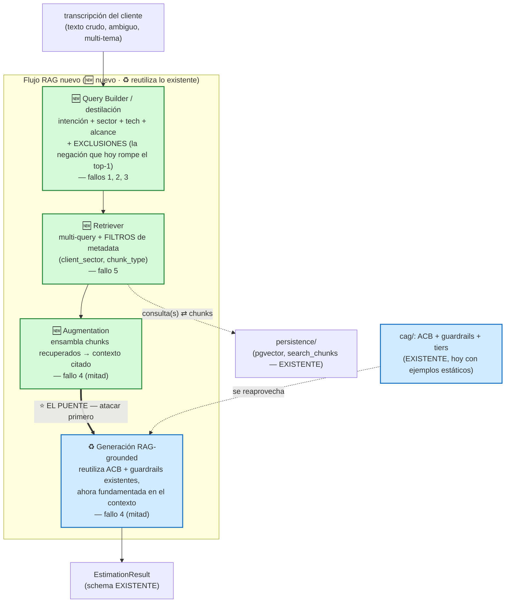

# Diagnóstico arquitectónico del sistema RAG actual

> Estado del servicio IA al cierre de Sesiones 06–08 y propuesta de evolución hasta la
> estimación generada. Pre-trabajo de la Sesión 09.

Corpus del trace: **corpus real solamente** — 15 presupuestos del sample + 1 documento de
prueba (`it/BUD-IT-001`) = 16 documentos / **33 chunks** `budget_component`. Los ~30k
chunks sintéticos del stress test de S08 se borraron antes del trace (vectores aleatorios
contaminarían el top-5 y harían ininterpretable la sección 2).

---

## 1. Diagrama de la arquitectura actual

Servicio IA FastAPI `v0.8.0`. El diagrama refleja los módulos **reales** de `app/` y los
cuatro endpoints registrados en `app/main.py`. La marca **⛔ AQUÍ ACABA LO IMPLEMENTADO**
señala el gap central: el store devuelve chunks que nadie consume para estimar, y el flujo
de estimación no consulta el store.

```mermaid
flowchart TB
  subgraph FE["Frontend"]
    ST["streamlit_app.py<br/>(formulario, cliente HTTP puro)"]
  end

  subgraph BE["Backend de negocio"]
    NB["(no hay backend de negocio propio:<br/>el cliente habla directo al servicio IA)"]
  end

  subgraph IA["Servicio IA — FastAPI (app/, v0.8.0)"]
    direction TB

    subgraph ING["app/ingest/ (S06)"]
      P1["catalog → loaders → parsers<br/>→ cleaning → normalizers"] --> DOC["Document[]"]
    end

    subgraph RAGP["app/generation/rag/ (S07–S08)"]
      CH["chunking/<br/>(structural + 7 estrategias)"] --> EM["embedding/<br/>(LiteLLMEmbedder,<br/>text-embedding-3-small, 1536d)"]
      EM --> STO["persistence/<br/>(pgvector, HNSW half-vec,<br/>search_chunks)"]
    end

    subgraph GEN["app/generation/cag + agentic (S05–S06)"]
      SE["cag/sessions + tiers + guardrails<br/>+ Actor-Critic-Boss<br/>estimación CAG (ejemplos ESTÁTICOS en el prompt)"]
    end

    EI["POST /embeddings/ingest"] --> CH
    ES["POST /search (query, k)"] --> EM
    STO --> HITS["top-k chunks + distancia coseno"]
    EE["POST /api/v1/sessions/&#123;id&#125;/estimate"] --> SE
    EG["POST /api/v1/ingest<br/>GET /api/v1/ingest/catalog"] --> P1
  end

  ST --> EE
  DOC -. "ingesta offline" .-> CH

  HITS -. "❌ nadie los consume para estimar" .-> GAP{{"⛔ AQUÍ ACABA LO IMPLEMENTADO"}}
  SE -. "❌ no consulta el store" .-> GAP
```



**Lectura del diagrama.** Hay dos subsistemas que no se tocan:

- **Indexación + búsqueda** (`ingest/` → `chunking/` → `embedding/` → `persistence/`,
  expuesto por `/embeddings/ingest` y `/search`). `/search` embebe la query y devuelve
  top-k chunks con su distancia. Funciona… y ahí muere: la respuesta es el final del flujo.
- **Estimación CAG** (`cag/sessions`, tiers, guardrails, ACB; expuesto por
  `/api/v1/sessions/{id}/estimate`). Genera estimaciones con **ejemplos estáticos
  incrustados en el prompt**; **nunca** llama a `search_chunks` ni mira el store.

Son **dos islas**. No existe el puente transcripción → consulta → retrieval → augmentation
→ generación.

---

## 2. Trace anotado de `02_ambiguous.txt`

Preparación reproducible (corpus real, sin sintéticos):

```bash
docker compose up -d postgres && uv run alembic upgrade head
uv run python -m scripts.ingest_corpus                 # 15 budgets (idempotente, 409 si ya están)
# borrar el seed sintético de S08 para no contaminar el top-5:
docker compose exec -T postgres psql -U estimator -d estimator \
  -c "DELETE FROM documents WHERE source_path = 'synthetic/stress-corpus';"
docker compose exec -T postgres psql -U estimator -d estimator \
  -c "SELECT chunk_type, count(*) FROM chunks GROUP BY chunk_type;"   # budget_component | 33
uv run uvicorn app.main:app                            # v0.8.0
```

Trace (único Python del ejercicio, `scripts/trace_pre_s09.py`):

```bash
uv run python -m scripts.trace_pre_s09 \
  --transcript examples/transcripts/02_ambiguous.txt \
  --out examples/transcripts/trace_02_ambiguous.out.txt
```

Salida cruda completa: [`examples/transcripts/trace_02_ambiguous.out.txt`](examples/transcripts/trace_02_ambiguous.out.txt).

### 2.1 Embedding de la transcripción

El paso 1 usa `LiteLLMEmbedder().embed_one(<transcripción completa>)` (no hay endpoint que
devuelva el vector crudo). Respuesta real:

```
[1] EMBEDDING de examples/transcripts/02_ambiguous.txt  (chars=1853)
  dim          = 1536
  L2 norm      = 1.000047
  first comp.  = 0.018433
  last comp.   = 0.008469
```

> **Observación.** 1853 caracteres de un texto que divaga entre inventario, facturación,
> CRM y una tienda online *que el cliente excluye* se colapsan en **un único vector de 1536
> dims normalizado** (norma ≈ 1.0). Es un centroide "promedio": diluye las intenciones
> concretas en una sola señal difusa.

### 2.2 Búsqueda semántica (top-5)

`/search` embebe internamente la `query` string, así que el trace es literalmente
`POST /search {query: <transcripción completa>, k: 5}`. Respuesta real:

```
[2] POST http://localhost:8000/search  {query: <transcripción>, k: 5}
  search_time_ms = 771
```

| # | chunk_id | doc | **distance** | budget_id | client_sector | tech | componente |
|---|---|---|---|---|---|---|---|
| 1 | 10 | 5 | **0.5851** | BUD-2024-005 | ecommerce | node_js | Cart and checkout service — *Headless e-commerce storefront* |
| 2 | 17 | 8 | **0.6206** | BUD-2024-008 | ecommerce | python | Returns automation — *Fashion returns automation and resale* |
| 3 | 27 | 13 | **0.6248** | BUD-2024-013 | industrial | java | Warehouse management core — *Warehouse management and slotting* |
| 4 | 16 | 7 | **0.6322** | BUD-2024-007 | ecommerce | node_js | Route optimization — *Grocery delivery slot booking and routing* |
| 5 | 28 | 13 | **0.6325** | BUD-2024-013 | industrial | java | Dynamic slotting — *Warehouse management and slotting* |

> **Observación.** Las cinco distancias caben en el rango **[0.5851, 0.6325]** — un spread
> de **0.047**. Están comprimidas y altas (coseno ≈ 0.6 ⇒ similitud ≈ 0.40): el índice
> ordena, pero no *discrimina*. La latencia (771 ms) la domina el embedding de la query
> por red, no la BD.

### 2.3 Relevancia de cada chunk

Lo que el cliente realmente pide (de la transcripción): **unificar el stock** disperso en
Excels, **descuento automático** al entrar un pedido, **visibilidad móvil**, **facturación**
(hoy a mano en Word) y una **ficha de cliente/CRM**. Excluye **explícitamente** la tienda
online ("*lo de la tienda online lo dejamos aparcado… de momento ni lo menciones*").

| # | chunk | ¿Relevante? | Juicio honesto |
|---|---|---|---|
| 1 | Cart & checkout (ecommerce) | ❌ No | **La más cercana es justo lo excluido**: carrito/checkout de una tienda online. |
| 2 | Returns automation (ecommerce) | ❌ No | Devoluciones de moda online; nada de inventario interno ni facturación. |
| 3 | Warehouse management core (industrial) | 🟡 Parcial | Lo más próximo al *need* (stock/almacén), pero es gestión industrial pesada (java), no un comercio de ~30 personas. |
| 4 | Route optimization (grocery) | ❌ No | Optimización de rutas de reparto; fuera de alcance. |
| 5 | Dynamic slotting (industrial) | 🟡 Parcial | Slotting de almacén; mismo matiz que el #3. |

> **Observación.** **0/5 fuertemente relevantes.** Los dos chunks tangencialmente útiles
> (#3, #5: warehouse/inventory) quedan **por debajo** de ecommerce irrelevante; y la
> coincidencia *número uno* es exactamente la pieza que el cliente pidió no mencionar.
> Además, de las tres necesidades explícitas (inventario, facturación, CRM) el retrieval
> solo roza una. Sin nada que filtre o reformule, el top-5 es ruido ordenado.

---

## 3. Diagnóstico: cinco fallos

Cada fallo cita el trace real del Paso 2.

### Fallo 1 — La transcripción se embebe como un único vector "promedio"
- **Problema observado.** El blob de 1853 chars se reduce a un solo vector (§2.1) y los 5
  hits vuelven con distancias casi idénticas: **0.5851, 0.6206, 0.6248, 0.6322, 0.6325**
  (spread 0.047, todas ≈ 0.6). El sistema no logra separar lo relevante de lo irrelevante.
- **Causa probable.** Se embebe el texto entero, multi-tema y con ruido conversacional,
  sin destilar una consulta. El centroide cae en "tierra de nadie" semántica.
- **Propuesta (sin implementar).** Un *query builder* que, antes de embeber, destile la
  transcripción a consulta(s) focalizada(s): intención, sector, tecnologías, alcance.

### Fallo 2 — La negación explícita del cliente se ignora
- **Problema observado.** La coincidencia más cercana (hit #1, distance **0.5851**) es
  "Cart and checkout service" de un *Headless e-commerce storefront* — **justo la tienda
  online que el cliente pidió NO mencionar**. Hits #2 y #4 también son ecommerce.
- **Causa probable.** Un embedding promedio no representa exclusiones; el coseno premia el
  solapamiento léxico/temático ("tienda", "pedidos", "clientes") aunque la frase sea una
  negación. La semántica de bolsa de palabras no entiende "esto no".
- **Propuesta.** Extracción de intención que capture **inclusiones y exclusiones**, o una
  consulta estructurada que se traduzca a filtros (excluir `ecommerce`/storefront aquí).

### Fallo 3 — Asimetría query ↔ chunk (escala e idioma)
- **Problema observado.** Query: 1853 chars en **español**, coloquial. Chunks: componentes
  cortos en **inglés** con headers contextuales (`[Project: … | Client sector: … | Main
  tech: …]`). Todo el top-5 se queda en distancia ≈ 0.6: señal débil de base.
- **Causa probable.** Desajuste de granularidad (texto largo vs chunk fino) y de idioma
  (corpus EN vs consulta ES) sin normalizar. *Honesto*: `text-embedding-3-small` es
  multilingüe y aun así recupera temáticamente, así que el gap se manifiesta como
  **distancia base elevada**, no como fallo total — pero contribuye a la compresión del §2.2.
- **Propuesta.** Normalizar la query al registro e idioma de los chunks (traducir/segmentar)
  antes de embeber, para ponerla en el mismo vecindario.

### Fallo 4 — Recuperación sin propósito de estimación (dos islas)
- **Problema observado.** Estos 5 chunks vuelven de `/search` y **ahí termina todo**: nada
  los convierte en contexto. En paralelo, `/api/v1/sessions/{id}/estimate` genera la
  estimación con **ejemplos estáticos** del prompt y **no consulta el store**.
- **Causa probable.** El store vectorial y el flujo de estimación CAG son subsistemas
  desconectados (ver §1): falta el puente retriever → augmentation → generación.
- **Propuesta.** Un retriever + augmentation que inyecten los chunks recuperados como
  contexto citado en una generación *RAG-grounded*, alimentando el `EstimationResult` existente.

### Fallo 5 — Retrieval ingenuo: solo coseno, k fijo, sin filtros ni multi-query
- **Problema observado.** El top-5 mezcla sectores (**ecommerce ×3, industrial ×2**) y
  tecnologías (node_js, python, java); los chunks genuinamente más cercanos al *need*
  (warehouse/inventory, chunks 27 y 28) caen a **#3 y #5**, por debajo de storefront
  ecommerce. `k=5` fijo arrastra ruido para una petición que mezcla inventario + facturación + CRM.
- **Causa probable.** Una sola query promediada sobre coseno puro, sin filtro de metadata
  (`client_sector`, `chunk_type`) ni descomposición multi-query (heredado de S08).
- **Propuesta.** Retriever con filtros de metadata (sector/tipo) y/o multi-query que
  descomponga la petición en sub-consultas y fusione resultados.

---

## 4. Propuesta de evolución arquitectónica

> El objetivo es cerrar el bucle de las "dos islas": convertir el `/search` que hoy muere
> en su respuesta en una cadena que termine en una estimación fundamentada. Lo que la
> diferencia de un RAG de manual son dos piezas concretas que el trace exige —**exclusiones**
> en la consulta y **filtros de metadata** en el retriever— y que la generación **reutiliza
> el Actor-Critic-Boss y los guardrails que ya existen**, no un generador nuevo. La pieza
> que atacaría primero es **el puente Augmentation→Generación** (marcado ⭐): es lo que hoy
> no existe y sin lo cual nada del resto cambia el producto.



**Cómo se distingue del estado actual.** En §1 la flecha del store terminaba en
`⛔ AQUÍ ACABA LO IMPLEMENTADO`; aquí esa flecha continúa hasta `EstimationResult`. Dos
detalles lo apartan del RAG de manual: (a) la consulta lleva **exclusiones** y el retriever
**filtra por metadata** (`client_sector`, `chunk_type`) — justo lo que el trace mostró roto,
no cajas genéricas; y (b) la **generación no es nueva: reutiliza el ACB y los guardrails**
existentes (caja azul ♻️), ahora alimentados por contexto recuperado en vez de ejemplos
estáticos. Solo `persistence/`, el ACB/guardrails y `EstimationResult` se reaprovechan; lo
verde es nuevo.

**Párrafo (responsabilidades, flujo de datos y pieza crítica).** El dato fluye
*transcripción → consulta(s) con exclusiones → chunks filtrados por sector/tipo → contexto
citado → estimación*. El **Query Builder** destila la transcripción capturando intención y,
sobre todo, **exclusiones** (el trace falla porque el top-1 es la tienda online que el
cliente pidió no mencionar); el **Retriever** envuelve `search_chunks` con **filtros de
metadata** y multi-query, que es lo que corrige el top-5 mezclado que observamos; la
**Augmentation** ensambla los chunks en contexto citado; y la **Generación RAG-grounded
reutiliza el Actor-Critic-Boss y los guardrails** ya existentes, ahora fundamentados en
presupuestos reales y no en ejemplos estáticos, volcándose al `EstimationResult`. La pieza
**más crítica, y la que atacaría primero, es el puente Augmentation→Generación**: hoy el
sistema son dos islas (el `/search` muere en su respuesta y la estimación corre ciega al
store), así que mientras ese puente no exista, *ninguna* mejora de query o retrieval cambia
el producto — la estimación jamás consume un solo chunk. Cerrar ese bucle es lo que convierte
"dos demos" en un RAG y, además, habilita medir de punta a punta si fundamentar mejora la
estimación; el query builder (exclusiones) y los filtros de metadata son la inversión
inmediata siguiente —es lo que el trace muestra roto—, pero el puente es la precondición
para que cualquiera de esas mejoras importe.
